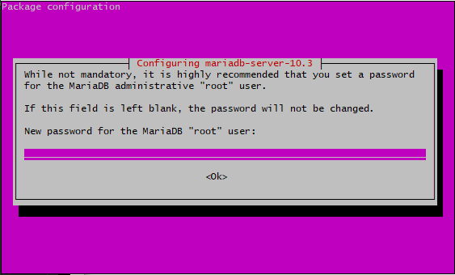

# ERP System

### Python Installation

Link related
https://www.vultr.com/docs/how-to-install-erpnext-open-source-erp-on-ubuntu-17-04-22771

- Before installing python, we need to install `software-properties-common` to avoid couldn't find package problem

```
sudo apt-get install software-properties-common
sudo add-apt-repository ppa:deadsnakes/ppa
```

- Then install python

```
sudo apt-get install python3.7 python3.7-dev python3.7-venv python3.7-doc python3-pip
```

- Now you have python on your VPS

### Install Ansible

- Ansible automates software provisioning, configuration management and application deployment.

```
sudo pip install ansible
```

## Installing MariaDB Server

- Add the MariaDB repository into the system.

```
sudo apt-key adv --recv-keys --keyserver hkp://keyserver.ubuntu.com:80 0xF1656F24C74CD1D8
sudo add-apt-repository 'deb [arch=amd64,i386,ppc64el] http://mirror.nodesdirect.com/mariadb/repo/10.3/ubuntu bionic main'
```

- Install MariaDB

```
sudo apt-get update
sudo apt -y install mariadb-server libmysqlclient-dev
```

- You will prompt to enter root password to MariaDB.
  

- The Barracuda storage engine is required for creation of ERPNext databases, so configure MariaDB to use Barracuda storage engine. Edit the default MariaDB configuration file `my.cnf`

```
sudo nano /etc/mysql/my.cnf
```

- Insert following line under `[mysqld]` line.

```
innodb-file-format=barracuda
innodb-file-per-table=1
innodb-large-prefix=1
character-set-client-handshake = FALSE
character-set-server = utf8mb4
collation-server = utf8mb4_unicode_ci
```

- Insert following line under `[mysql]` line.

```
default-character-set = utf8mb4
```

//////////////////////////////////////////////////////////
This line still not done

- Under `[mysqldump]` change `max_allowed_packet` to `64M`
- Under `[isamchk]` change `key_buffer` to `64M`
  //////////////////////////////////////////////////////////

- Edit `innodb_buffer_pool_size` from `256M` to `2000M`
- Restart MariaDB

```
sudo systemctl restart mariadb
sudo systemctl enable mariadb
```

- Test the server by typing below command. If problem, some error shows up

```
sudo systemctl mysql restart
```

- Before configuring the databse, we need to secure MariaDB. Use below command to secure it.

```
sudo mysql_secure_installation
```

- Running the above command you will be prompted will several question.

1. Enter the root password
2. Change the root password - n (only y if you want)
3. Remove anonymous users - n
4. Dissallow root login remotely - Y
5. Remove test database - n
6. Reload privilege tables - Y

## Install Nginx, Node.js and Redis

- Add the Nodesource repository for Node.js 12.x.

```
sudo curl --silent --location https://deb.nodesource.com/setup_12.x | sudo bash -
```

- Install and update yarn with below 3 command

```
curl -sL https://dl.yarnpkg.com/debian/pubkey.gpg | gpg --dearmor | sudo tee /usr/share/keyrings/yarnkey.gpg >/dev/null
```

```
echo "deb [signed-by=/usr/share/keyrings/yarnkey.gpg] https://dl.yarnpkg.com/debian stable main" | sudo tee /etc/apt/sources.list.d/yarn.list
```

```
sudo apt-get update && sudo apt-get install yarn
```

- Check whether apache is exist or not.

```
sudo apt purge apache2
```

- If exist, please uninstall first
- Install, Nginx, nodejs, redis and supervisor

```
sudo apt -y install nginx nodejs redis-server supervisor
```

- After installation complete, enable the nginx

```
sudo systemctl start nginx
sudo systemctl enable nginx
```

- Start and enable Redis

```
sudo systemctl start redis-server
sudo systemctl enable redis-server
```

## Install PDF Converter

- The `wkhtmltopdf` converts HTML to PDF

```
sudo apt -y install libxrender1 libxext6 xfonts-75dpi xfonts-base
```

- Then download the latest `wkhtmltopdf` downloader from https://wkhtmltopdf.org/downloads.html
- Go to Ubuntu 20.04(focal) amd64 and copy link address (https://github.com/wkhtmltopdf/packaging/releases/download/0.12.6-1/wkhtmltox_0.12.6-1.focal_amd64.deb)

```
wget https://github.com/wkhtmltopdf/packaging/releases/download/0.12.6-1/wkhtmltox_0.12.6-1.focal_amd64.deb
```

- Install with sudo

```
sudo dpkg -i wkhtmltox_0.12.6-1.focal_amd64.deb
```

- If error happens, run below command first. This will install missing depedencies. After that run the installation command again.

```
sudo apt-get -f install
```

- Run below command to ensure `wkhtmltopdf` successfully installed

```
wkhtmltopdf --version
```

- Run below command to install neccessary package

```
sudo apt-get git curl nano pv
```

- Go to mysql to ensure database successfully install

```
mysql -u root -p
```

## Add User

- Add new user rather than login as root

```
sudo adduser frappe
```

- Add sudo to the user

```
sudo usermod -aG sudo frappe
```

- Switch the user

```
sudo su - frappe
```

## Install Bench

- Install frappe bench

```
sudo pip3 install frappe-bench
```

- To test it is installed

```
bench
```

- Initialize the project

```
bench init --frappe-branch=version-13-beta frappe-bench --python=python3.7
```
